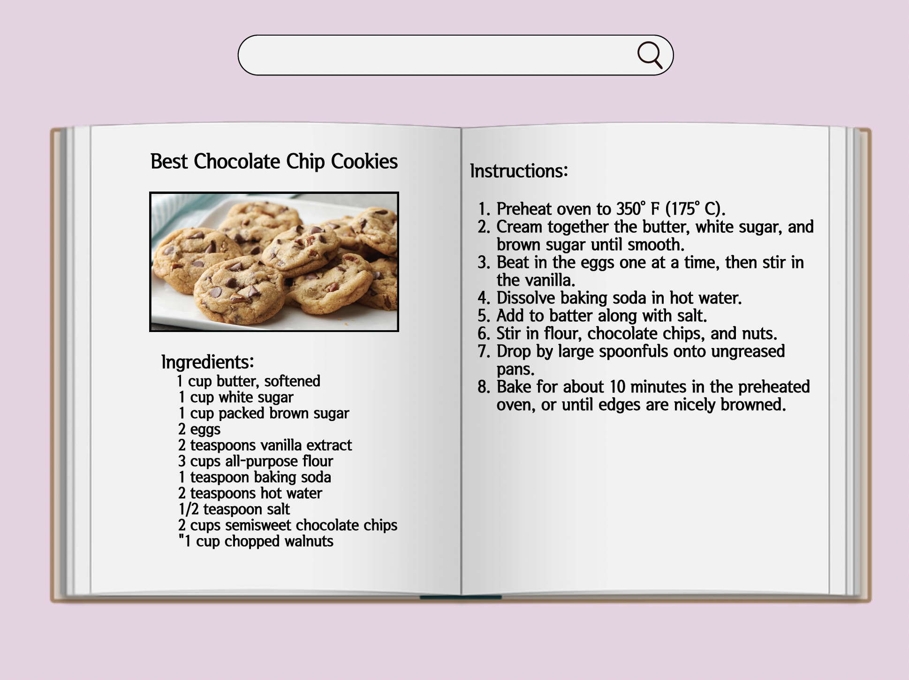

# Project 1 Documentation

### Project Description
This project presents baking and cooking recipes from a data set that consists of over 30,000 different recipes. The website displays a digital cookbook that ideally shows the full recipe in one screen, in that case, across two empty open book pages. The goal is to make it easy for the chef, baker, or whoever is making food to find the recipe of their choice in a quick search, eliminating the need of looking through a printed book as well as making it convenient for them to look at the full recipe at once, without the need to scroll down to look at more instructions, since it's very likely that their hands could be dirty once they have started the process.

### Inspiration
Since I am someone who bakes and cooks all the time, I often find it difficult to follow through with a website while in the making. Sometimes I would be pouring something, breaking eggs, or cutting vegetables, for example, and I would need to look again at the recipe to make sure I have the correct measurements and what my next step would be. I waste time in between steps to go wash my hands to be able to scroll, and so this is a problem that I would want to fix for myself as well as anyone else who encounters the same problem.

### Process
The first thing I did was come up with an idea that I would like to implement. I searched for datasets that align with my interests but couldn't think of creative ways to have them shared, or the way I would display them would have been already available on the internet. After hours of thinking and searching, I decided to include something that I am passionate about, which is baking or cooking. 
The next step was to find anb API or dataset online that has a variety of options and details that I could parse and use. I was surprised to find that most of the APIs were very expensive and needed a membership. I searched a bit more until I came across a website called [Recipe Box](https://eightportions.com/datasets/Recipes/) that had a static data set consisting of around 40,000 recipes and I decided to use it. Like the other data sets that I found, this one wasn't perfect either and it had the word "ADVERTISEMENT" at the end of each line for the ingredients so I went in and changed it in the json file.

The next thing I did was use Figma to make a wireframe of what I would like my website to look like. My goal was to make it user-friendly and easy for people of all ages, that have access to a laptop when baking or cooking, to use, so I decided to have it look like the image below:

### Challenges
The first challenge that I encountered was coming up with an idea. I looked through hundreds of data sets but couldn't choose a topic that I wanted to cover as I am a very indecisive person, this caused a huge delay in when I would actually start the implementation.

### Lessons and Next Steps
