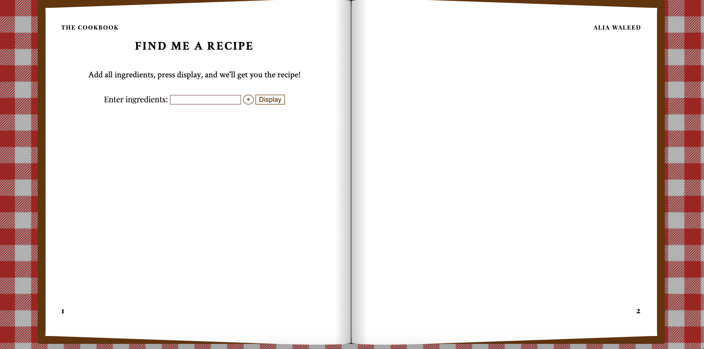

# Project 1 Documentation

### Title
[Fine Me a Recipe](https://aliawaleed.github.io/connectionsLab/project1/index.html)

### Description
This project presents baking and cooking recipes from a data set that I compiled with around 60 recipes. The goal of the website is to ease the process of cooking and making decisions on what to make for the baker, chef, or anyone who is about to make food. The welcome screen is simple and easy to navigate, with basic instructions on what to do or not to do, catering to people of all ages. The user is first asked about the ingredients that they would like to use or incorporate in their dish. This is followed by the display of full recipes on one screen, across 2 open book pages when viewed from a laptop, and around 2 screenshots worth if viewed on a phone or a smaller device. It presents the best matching recipe that includes as many as possible ingredients from the user input and gives them the option to look through other ones in case they do not like the recipe that they are currently on. The website solves 5 problems that users face when following recipes, especially on websites that are currently available online:
1. It eliminates the need for looking through a printed book 
2. It makes it convenient for people to look at full recipes at once, without the need to scroll down to look at more instructions (if their hands are dirty)
3. It removes all unnecessary information that users tend to see when looking at a recipe
4. It reduces food waste if the user decides to input ingredients that would go bad or expire
5. It makes the decision-making process for what to make much faster

### Inspiration
Since I am someone who bakes and cooks all the time, I often find it difficult to follow through with a website while in the process. Sometimes I would be pouring something, cracking eggs, or cutting vegetables, and need to look back at the recipe to make sure I have the correct measurements or find out what my next step would be. I waste time in between steps to go wash my hands to be able to scroll or miss instructions or timely aspects, especially if the website includes information that is not related to the dish that I am making. I am also a very indecisive person and always have trouble deciding what to eat or make and so if I am limited to certain ingredients, I would want to find recipes that would incorporate them, to also use ingredients before they go bad. These problems are ones that I would want to fix for myself as well as millions of people around that face the same problems on a daily basis. 

### Process
The first thing I did was come up with an idea that I would like to implement. I searched for datasets that align with my interests but couldn't think of creative ways to have them shared, or the way I would display them would have been already available on the internet. After hours of thinking and searching, I decided to solve a problem in something that I am passionate about, which is baking (and cooking). 

The next step was to find an API or dataset online that has a variety of options and details that I could parse and use. I was surprised to find that most of the APIs were very expensive and needed a membership. I searched a bit more until I came across a website called [Recipe Box](https://eightportions.com/datasets/Recipes/) that had a static dataset consisting of around 40,000 recipes and I decided to use it. Like the other datasets that I found, this one wasn't perfect either, the format wasn't ideal and it had the word "ADVERTISEMENT" written at the end of each list of ingredients. I created a new JSON file that includes a sample of all recipes, I formatted it in a way that could be easily used, by myself as well as others, did some minor changes in the text such as using "°" instead of the word "degree", and I found and added links for images for each recipe.

The next thing I did was use Figma to create a wireframe of what I would like my website to look like. My goal was to make it user-friendly, simple, and easy for people of all ages, ranging from children that are cooking with their parents or friends to elders that have access to a laptop when baking or cooking, so I decided to create the website as a book to make it easy for navigation and understanding. The wireframe is presented in the image below:


The next step was to use the data set, create the HTML, CSS, and JavaScript files, and link them all together to ensure that the data could be parsed and displayed on the webpage properly. On load, the JavaScript file gathers all of the information from the JSON file, stores it into different arrays, sections, and tags, for easy access and screen display. This process took me a long time since it was the first time for me to work with data visualization, to decide on the tags that would best fit and separate all text blobs into individual lines, create ingredients lists, and split the instructions into numbered lists. Once the data was displayed on the website, I was good to start with the design implementation and decisions.

As my initial plan was to add a png of a book, I felt that it wouldn't work and instead decided to create separate divs instead, so that the display is proper on all kinds of devices and is easily adjustable. For the book design and edges, I mostly used [this](https://codepen.io/erinesullivan/pen/gxdbzp) implementation. It also took me a really long time to understand this code, and adjust it in ways that would fit my objectives and purpose. A lot of changes had to be made to ensure that it's viewed properly from different devices and that it reacts accurately.

The hardest part, which I will discuss in detail in the challenges, was the following one, which was what to display and when. This is to get the user input from the welcome screen, check for errors, store the ingredients that they want to use, look over all of the recipes and all of the ingredients, find the best recipe that would match the most, and display this specific recipe on the screen. Not only that, but also added a shuffle button that finds any other recipe with the same level of matching and randomizes the one that would be displayed next. I kept going back and forth to make sure that I try not to miss out on any possible error.

The very last thing I did was develop the mobile view and make sure that the users are not confused by displaying error messages, instructions if needed, alerts if only one recipe exists, and fixed an error in the shuffle button where the same recipe could be displayed more than one time in a row. 

### Challenges and Solutions
1. The first challenge that I encountered was coming up with an idea. I looked through hundreds of datasets but couldn't choose a topic that I wanted to cover as I am a very indecisive person, this caused a huge delay in when I would actually start the implementation.
2. Another challenge that I encountered was the formatting of the dataset as it was not formatted properly with no common names for the first element of each list, and so I created a new JSON file and copied the information that I needed in a readable format for the JavaScript file and made some modifications.
3. Displaying the information on the screen and adding to the HTML file in a format that is easily understood and accessed whenever needed for the presentation of the recipes, understanding the code, and making changes in the CSS and JavaScript file. I need to make changes in the way some of the information was read as well, such as splitting the instructions from one long string to an ordered list of what to do. For the recipes overall, I found that the best way to loop through them was to store them into an array for easier access and iteration.
4. The hardest challenge that took the longest time to solve was to compare the user input to the recipes' ingredients and find the best matches. To solve this problem:
    - I stored the user input into an array
    - I created an empty array for the recipe options that have the best match (the highest number of common ingredients)
    - I created a dictionary that has the recipes as the keys, with the number of matches as the values
    - I created a boolean array to check if user input exists in recipe (the reason I made a boolean array was to avoid repetition, such as eggs and egg yolks, that were seen as two separate items)
    - I made nested for loops that go over each ingredient from the user and each ingredient in each recipe and increase the count for the number of matches and change the boolean to 1 
    - I then added all of the values to their respective keys in the dictionary
    - I found the maximum value and all of the recipes that have the same value and pushed them to the options array to later be displayed
  
  ```
    let max = 0; 
    for(var key in dict){
        var value = dict[key];
        if (value > max){
            max = value; //set max value to the highest one
        }
        console.log("the max is", max);
    }

    for(var key in dict){
        var value = dict[key];
        if (value == max && value > 0 ){ //find all recipes with the same number of matches and add them to list of options
            options.push(recipesDivs[key]);
        }
    }
```
5. Accurately displaying and (un)displaying elements in their correct time and place. I had to go over each element and change its display to "none" or "block" when required and changed the inner text whenever needed in different functions. I also had to make a lot of adjustments to the book template that I found and make design decisions when showing the information. At this point, I also changed the display of the ingredients as I had noticed that the last instructions for some of the recipes did not have space to show and so I displayed the ingredients in a table/columns format, which is something that I had never worked with
6. Displaying a new random recipe whenever the user presses on the shuffle button. I would sometimes have the same recipe displayed more than once, and so it appears to the user that nothing has changed, as stated earlier, and so I created a global variable that I assigned the index to and made sure that it was not repeated when the shuffle button is clicked. Below is how I ensured that a random recipe is chosen each time with no repetition twice in a row.
  
  ```
  function anotherOption(){ //another option from array of options if user clicks on the shuffle button
      options[current].style.display = "none"; //do not display current recipe

      let random = Math.floor(Math.random()*options.length); //get another random recipe
      while (random == current) {  // to avoid getting the same recipe twice in a row
          if (options.length == 1){ //if there is only one recipe that matches display alert
              alert("Sorry! that's the only recipe we have that matches your input!");
              break;
          }
          // console.log("same"); //to see how many times the random value is the same
          random = Math.floor(Math.random()*options.length)
          if (random != current) {
              break;
          }
      }
      current = random; //set new current value
      options[random].style.display = "block";
  }
```

### Lessons and Next Steps
 Learnings:
 <li> Making a fully functional website 
 <li> Finding the right sources to search for solutions whenever I encounter a problem
 <li> The importance of logic and sequencing before writing the code, especially when using for loops
 <li> Using the console and developer tools to spot errors, comment out different elements in CSS or change them to fit the desired output
 
 The next steps that I would like to take are:
<li> To add more recipes to the data set to develop the website further and have a wider variety of recipes to choose from 
<li> Possibly work on the design of the front page, maybe feature a few recipes, just so the pages aren't completely blank
  
  
### The Final Display
The landing page:
  

  
Example of recipe output:
  


### References
[Recipe Box](https://eightportions.com/datasets/Recipes/) for the data set
[Book Layout](https://codepen.io/erinesullivan/pen/gxdbzp)
